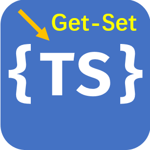
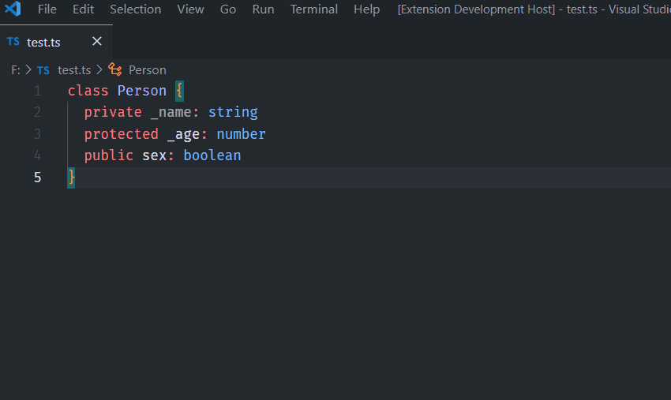

# vscode-ts-getset

  

_vscode-ts-getset_ can generate getter and setter for a TypeScript class. It works based on AST (TypeScript Compiler API) instead of Regular Expressions.

  

## How to Start

- Put your input cursor at the first line of class declaration.
- Run VSCode command `Generate Getter Only` / `Generate Setter Only` / `Generate Getter & Setter` as you want. (Press [F1] on Windows to open VSCode command prompt.)

## Features

- Reliable class property collecting based on TSC API.
- Generations products are inserted automatically at the end of property declarations with pretty alignment.
- Nice error message.
- NOTICE THAT **only those class declarations at top level are supported** currently.
- Only private and protected properties are concerned. And their names should start with an underscore (`_`).

## TODO

Contributions are strongly welcomed!

- [ ] use AST instead of regex to get class name

## License

MIT
